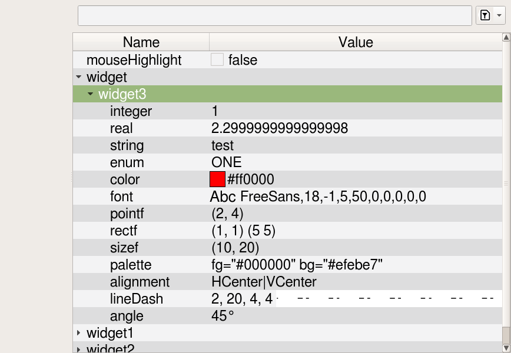

# CQPropertyView

## Qt Property Editor
This project builds successfully with Qt 5.15.2 on apt-based Linux distros

## Dependencies
This package depends on other repositories in (colinw7's)[https://github.com/colinw7] GitHub.

Additional dependencies are standard UNIX packages:
 + png
   + libpng12.so.0
 + jpeg
   + libjpeg.so.8
 + tre
   + libtre.so.5

## Download and Installation
There is a turn-key build script in `scripts/build.sh`
To use:
- `git clone git@github.com:shitwolfymakes/CQPropertyView.git`
- `cd CQPropertyView/scripts`
- `sudo chmod +x scripts/build.sh`
- `./build.sh` (don't run with sudo or the permissions will get broken)

This will download colinw7's dependencies into `external/` and then build each
before building `src/` and `test/`

